<div align="center">

# 🧬 distill-forge

### 把任何人的思维方式,蒸馏成一个带逐字溯源的「视角」skill

从资料海量的名人 👔,到只有零星访谈的小众高手 🎙️ —— 都能蒸馏。

<br>



<br>


</div>

---

## ✨ 一句话

> **distill-forge 是一个「造 skill 的 skill」。** 你说一句「蒸馏马斯克」,它就帮你产出一个能跑的 `musk-perspective` skill —— 以后随时可以「用马斯克的视角看这个决策」。

但它不是让 AI 凭印象 cosplay 一个人。它抽取的是这个人的**认知操作系统** 🧠:

- 🧩 **心智模型** —— 他反复用来切问题的底层框架
- ⚖️ **决策启发** —— 他做选择时的经验法则
- 🗣️ **表达 DNA** —— 他怎么说话(句式、口头禅、节奏,可量化)
- 🚫 **价值边界** —— 他明确拒绝做的事、内部的真实矛盾
- 🪧 **诚实局限** —— 这个 skill **不该被信任**的地方

---

## 🩸 它为什么存在

蒸馏一个人,最大的风险是 **AI 幻觉**:它会非常流畅地"编"出这个人根本没说过的话,尤其是那些它训练里见过无数次的名人。

> **最高原则:标注了局限的诚实 60 分 🎯,胜过看起来 90 分的伪造品 🎭。**

distill-forge 的全部设计,就是把"AI 凭记忆造人格"挡在门外 👮 —— 靠**强制溯源**和**诚实置信度**,而不是靠"听起来很像"。

---

## 🎬 工作原理(顶部动画的文字版)

| | 阶段 | 在干什么 |
|:--:|---|---|
| 👤 | **0 · 选定人物** | 显式指定,或从一句模糊需求(「我想提升决策」)反推该蒸馏谁 |
| 📚 | **1 · 六路采集** | 6 个 agent 并行扒公开资料:著作 / 对话 / 表达 / 他者 / 决策 / 时间线。**一手原话必须落盘存档** |
| 🔍 | **2 · 验证 · 溯源** | 三重验证升级"心智模型";每条"一手"引用必须**逐字命中存档原文**,否则自动降级为"推测" |
| 🧠 | **3 · 提炼框架** | 心智模型 × 决策启发 × 表达 DNA × 价值边界 × 诚实局限 |
| ✨ | **4 · 生成 skill** | 产出一个自包含、可复用、可重跑校验的「视角 skill」 |

> 🧯 **关键的那一拍(动画里的绿勾/红叉)**:系统会算出「**声称是一手** vs **真能逐字核验的一手**」的差值 —— 这就是"这次蒸馏有没有掺水"的体检分。编造的引用,当场拦截。

---

## 🚀 安装 & 用法

```bash
# 跨 runtime(Claude Code / Cursor / Codex …)
npx skills add github:kayali123/distill-forge
```

> 或手动放到 `~/.claude/skills/distill-forge/`(Windows:`C:\Users\<你>\.claude\skills\distill-forge\`)。

装好后,直接说话即可触发 👇

```text
蒸馏马斯克
造一个芒格的 skill
用纳瓦尔的视角看这个三选一
更新马斯克的 skill / 重新验证马斯克
```

---

## 🔬 反幻觉是怎么做到的(核心)

一条素材想拿到 `一手` 标签,必须**同时**满足两件事,缺一不可 🔒:

1. 📥 **经 `fetch_source.py` 落盘** —— 把原文整篇存进 `references/sources/`,而不是"我搜到个 URL 说他这么想"
2. 🔎 **经 `quality_check.py` 逐字核验** —— 引用的那句话必须能在存档原文里(归一化后)定位到

判定顺序固定:**来源平台 → 作者身份 → 一手/二手/推测 → 落盘 → 逐字核验**。

- 🚷 知乎 / 公众号 / 百度系默认拒(除非是作者本人认证渠道)
- 📰 36氪 / 财新等优质媒体也不享受无条件可信 —— 本人逐字 = 一手,记者转述 = 二手
- ❌ 只有 URL、span 对不上、凭记忆外推 → 一律 `推测`

> 资料越多的名人,门槛反而**越高**(一手占比 >70% + 冷召回防污染);资料稀疏的小众高手,不硬凑,诚实标"置信度低"。

---

## 🧩 目录结构

```
distill-forge/
├── 📄 SKILL.md                          # 编排器(含「约定 / CONTRACT」)
├── 📁 references/
│   ├── extraction-framework.md          # 三重验证 + 五层提取 + 需求反推表 + fame_tier 自适应
│   ├── skill-template.roleplay.md       # 🎭 沉浸第一人称模板
│   ├── skill-template.advisor.md        # 🧑‍🏫 第三人称顾问模板
│   ├── ethics-routing.md                # ⚖️ target_class 四分类 + consent 闸门
│   ├── source-gating.md                 # 🚦 provenance-first 来源闸门
│   └── research-protocol.template.md    # 🧭 运行时按心智模型派生搜索维度
├── 🎞️ assets/how-it-works.svg            # 顶部那张动画
└── 🐍 scripts/                          # 纯标准库 Python,Windows / py3 可跑
```

## 🧪 内置脚本

| 脚本 | 作用 |
|---|---|
| 🏗️ `scaffold.py` | 建自包含目录树 |
| 📥 `fetch_source.py` | 抓原文落盘(provenance 锚) |
| ✅ `quality_check.py` | **一手引用逐字指纹校验**(实测能抓出伪造引用) |
| 🗣️ `expression_dna.py` | 6 个表达指纹指标 |
| 🔁 `run_eval.py` | 可重跑回归套件,查人格漂移 |
| 🎬 `srt_clean.py` | 字幕清洗 |

---

## ⚖️ 伦理

生成的每个「视角 skill」基于**公开记录**蒸馏,**不代表本人真实观点**,并随附 `target_class` / `consent_basis` 出处。🙅 请勿用于冒充、骚扰或误导真实的人。

## 🙏 致谢 & License

灵感来自 [@alchaincyf](https://github.com/alchaincyf) 的 [nuwa-skill](https://github.com/alchaincyf/nuwa-skill) 💛 · Released under the **MIT License**.

<div align="center"><sub>诚实的 60 分,胜过伪造的 90 分。</sub></div>
